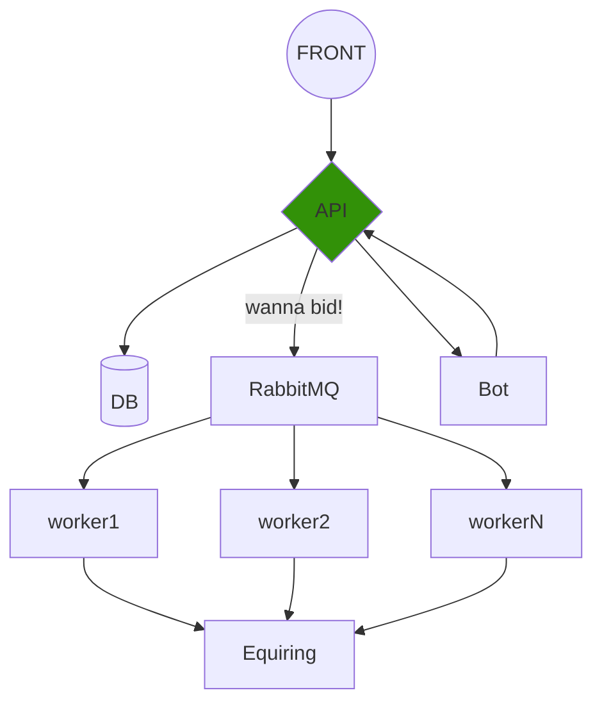

# POGROM
eAuction for unique crafts

# Scheme

```mermaid
flowchart TD;
    FR((FRONT))-->A{API};
    style A fill:#329108
    A-->DB[(DB)];
    A--wanna bid!-->RabbitMQ;
    A-->Bot;
    Bot-->A;
    RabbitMQ-->worker1;
    RabbitMQ-->worker2;
    RabbitMQ-->workerN;
    worker1-->Equiring;
    worker2-->Equiring;
    workerN-->Equiring;
```
